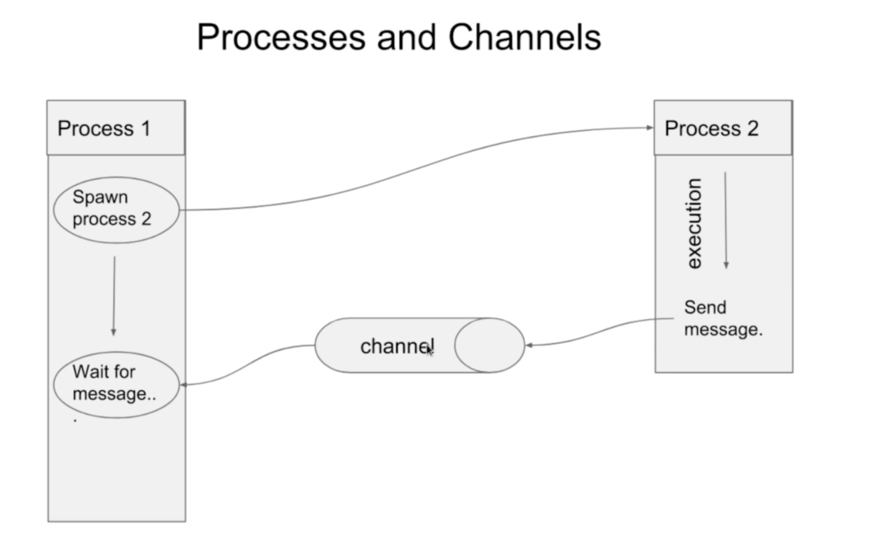

# Channels
---
Design of concurrent flow



---
## Syntax - creating of channel
```go
channel := make(chan int, 10)
// make(chan <type, string | int | any>, size of the channel)
// if size is not specified, the channel can have atmost 1 value
```

## Syntax - to span a new process
```go
func main(){
    // some process
    // ...
    // ...
    // span new process
    go process2()
}
```

## Syntax - Read & Write to a channel
```go
// write
channel <- 1

// read
a := <- channel
```

### EXAMPLE

1. Reduce program execution time with concurrent span

<!-- MARKDOWN-AUTO-DOCS:START (CODE:src=./examples/channel_span/two_process.go) -->
<!-- The below code snippet is automatically added from ./examples/channel_span/two_process.go -->
```go
package main

import (
	"fmt"
	"time"

	"github.com/the-mohamed-riaz/golang/common"
)

func process2(n int, channel chan int) {
	time.Sleep(time.Second * 1)
	channel <- (n * 100)
}
func main() {
	defer common.Exec()()
	println("i am process 1")
	ints := []int{1, 2, 3, 4}
	l := len(ints)
	channel := make(chan int, l)
	// write in channel
	for _, n := range ints {
		go process2(n, channel) // with this total exec time is ~ 1 sec
		// process2(n, channel) // with this total exec time is ~ 4 sec
	}
	for i := 0; i < l; i++ {
		val := <-channel
		fmt.Printf("%v\n", val)
	}
}
```
<!-- MARKDOWN-AUTO-DOCS:END -->